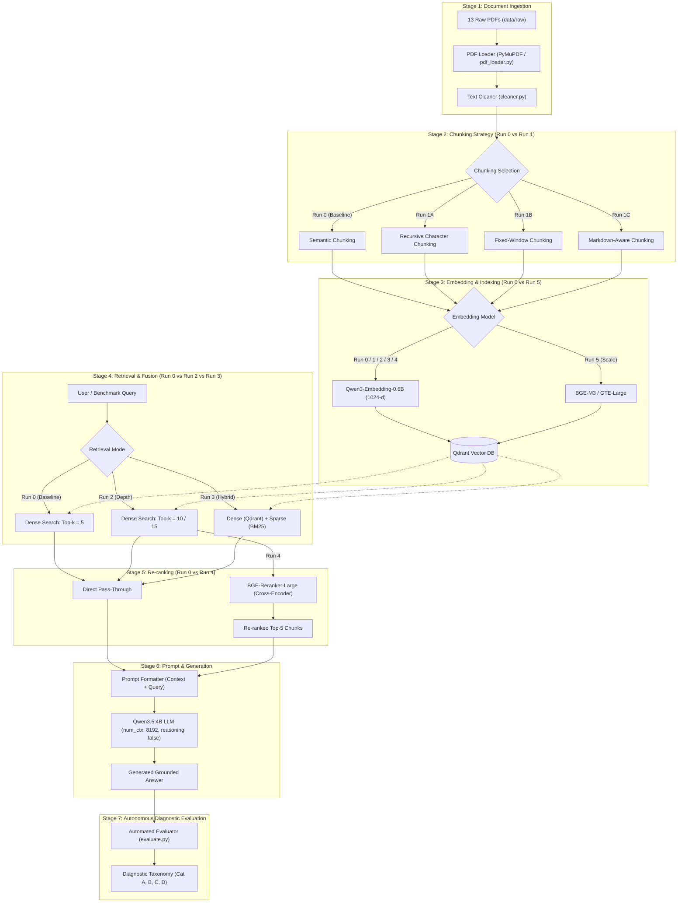
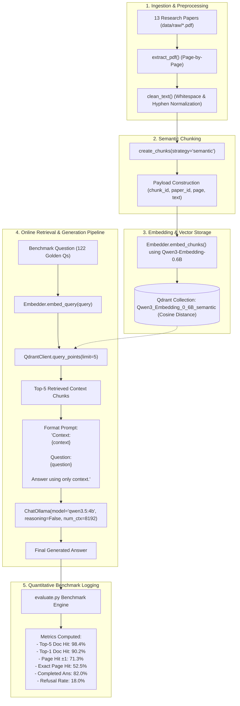
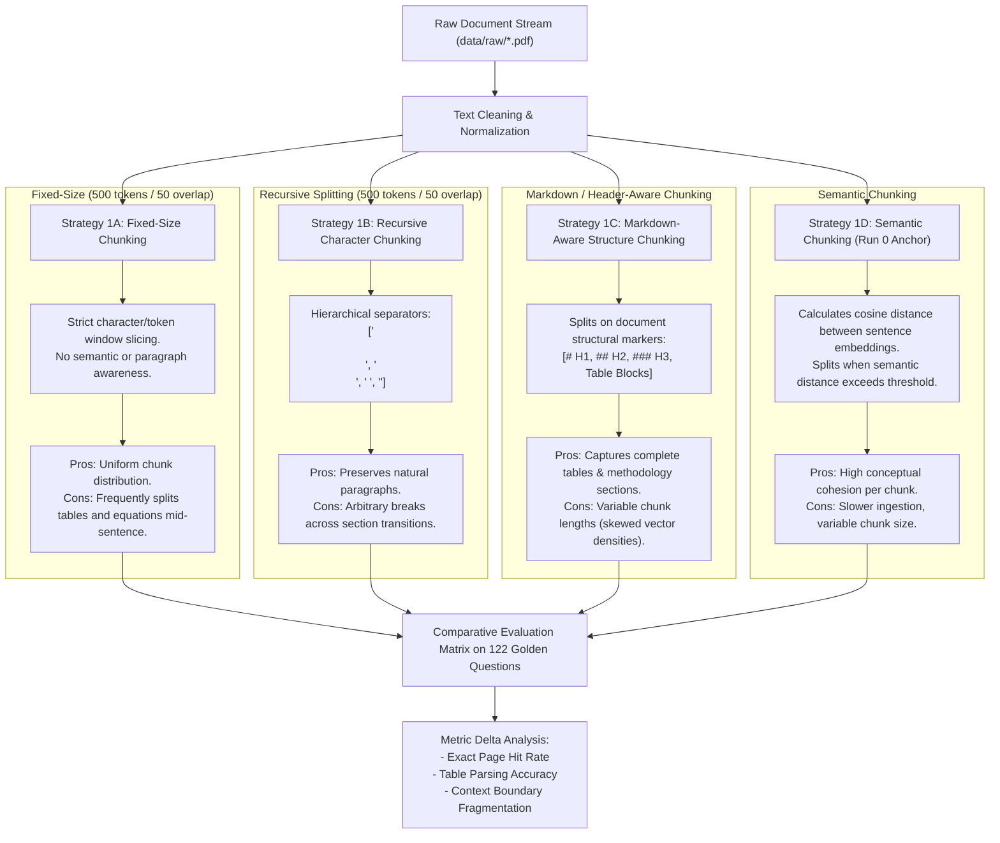
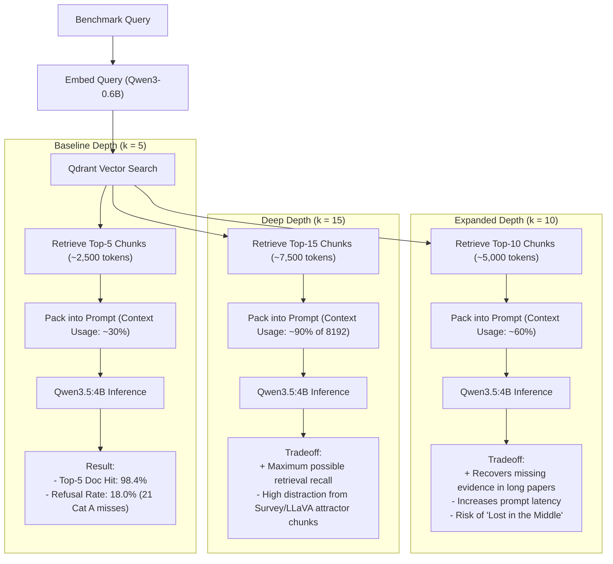
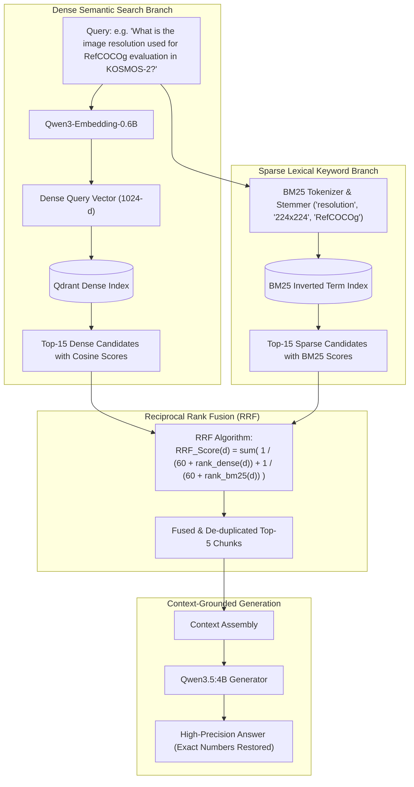
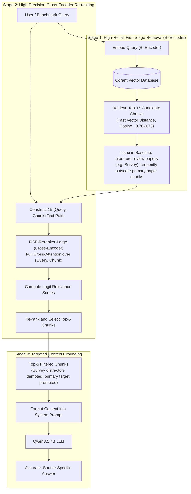
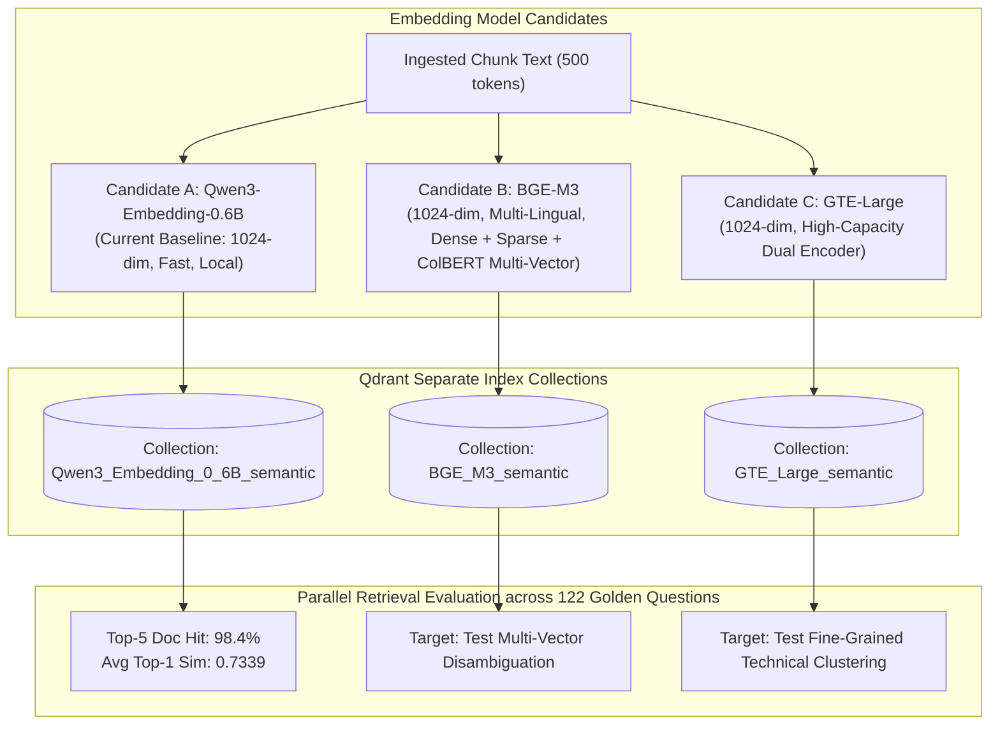
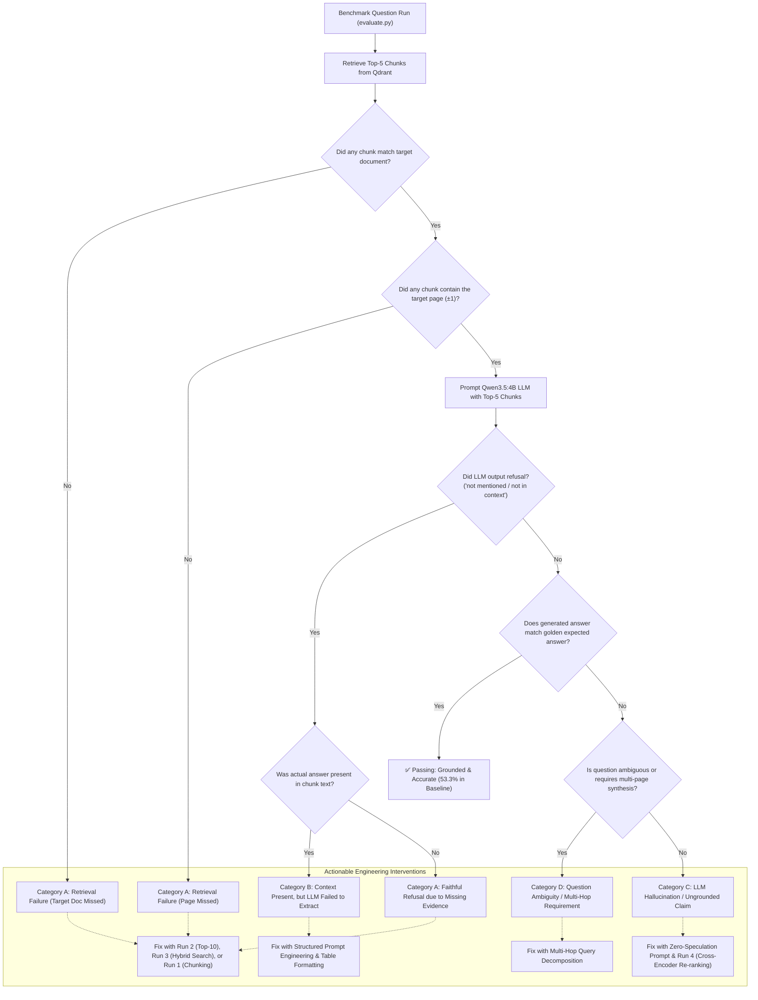

# 📊 Case Study: End-to-End Flow Diagrams for Every Experimental Run

**Project:** Autonomous RAG Pipeline Benchmark & Case Study  
**Corpus:** 13 Multimodal Vision-Language & Embodied AI Research Papers  
**Benchmark:** 122 Curated Golden Questions across 8 Taxonomy Classes  

This document provides dedicated, production-grade architecture flow diagrams for **every experimental run** analyzed in the RAG Case Study ([RAG_CASE_STUDY.md](file:///home/shyam/rag/evaluation/results/RAG_CASE_STUDY.md)) and tracked in the Experiment Registry ([EXPERIMENTS.md](file:///home/shyam/rag/evaluation/results/EXPERIMENTS.md)).

---

## 🗺️ Master Architecture Overview

The diagram below maps the complete RAG lifecycle and shows where each experimental run intervenes:

---

## 🔒 Run 0: Baseline Architecture (Frozen Benchmark)

**Configuration:** Semantic Chunking + `Qwen3-Embedding-0.6B` + Qdrant Top-5 + `Qwen3.5:4B` (`num_ctx: 8192`, `reasoning: false`, `num_predict: 1024`).  
**Core Metric Anchor:** **98.4%** Top-5 Document Hit | **82.0%** LLM Completion Rate | **0%** Cutoff Rate.

---

## 📋 Run 1: Chunking Strategies Comparison Flow

**Objective:** Compare 4 chunking strategies to eliminate page fragmentation and solve long-document retrieval issues (such as Flamingo's low 33.3% page hit in baseline).

---

## 📋 Run 2: Retrieval Depth (Top-$k$ Scaling: 5 vs 10 vs 15)

**Objective:** Test if increasing retrieval depth from $k=5$ to $k=10$ or $k=15$ recovers the 21 missing evidence chunks (Category A failures), without overwhelming the LLM with irrelevant survey distractors.

---

## 📋 Run 3: Hybrid Search (Dense Vector + BM25 Sparse Keyword Fusion)

**Objective:** Combine dense semantic retrieval with sparse lexical BM25 retrieval to fix keyword/numerical misses (e.g., exact model parameters, dataset numbers where baseline completed answers was only 54.5%).

---

## 📋 Run 4: Two-Stage Re-ranking Flow (Bi-Encoder + Cross-Encoder)

**Objective:** Mitigate literature survey attractors (e.g. Survey Paper or LLaVA displacing primary paper chunks) by scoring `[Query, Chunk]` pairs jointly with a full cross-attention model (`BGE-Reranker-Large`).

---

## 📋 Run 5: Embedding Model Scaling & Representation Flow

**Objective:** Compare embedding representation models to evaluate how vector dimensionality, multi-lingual capabilities, and architecture size affect retrieval hit rates.

---

## 🧪 Automated Failure Classification & Diagnostic Loop

The evaluation engine automatically audits every question and categorizes errors into four actionable buckets:

---

## 📌 Summary Reference Table of All Runs

| Run # | Experiment Name | Primary Variable Changed | Upstream Dependency | Key Problem Solved |
| :---: | :--- | :--- | :--- | :--- |
| **0** | **Baseline (Frozen)** | Control Anchor | Semantic + Qwen3-0.6B + Qdrant Top-5 + Qwen3.5:4B | Foundation benchmark (98.4% Doc Hit, 82.0% Ans) |
| **1** | **Chunking Strategies** | Chunking Algorithm (Recursive / Fixed / Markdown / Semantic) | Ingestion & `chunking.py` | Eliminates table fragmentation & improves page precision |
| **2** | **Retrieval Depth** | Top-$k$ parameter ($k=5 \rightarrow 10 \rightarrow 15$) | `evaluate.py` retriever limit | Recovers missing evidence chunks for long papers |
| **3** | **Hybrid Search** | Dual-channel retrieval (Dense Cosine + Sparse BM25 + RRF) | Sparse index + Qdrant | Resolves numerical & exact keyword token misses |
| **4** | **Re-ranking** | Cross-Encoder (`BGE-Reranker-Large`) over Top-15 | Two-stage inference pipeline | Discards literature survey attractors; promotes primary papers |
| **5** | **Embedding Scaling** | Vector Model (`Qwen3-0.6B` vs `BGE-M3` vs `GTE-Large`) | Model embedding dimension & weights | Evaluates vector representation geometry & capacity |

---

*File generated for RAG Case Study documentation. Linked from [RAG_CASE_STUDY.md](file:///home/shyam/rag/evaluation/results/RAG_CASE_STUDY.md) and [EXPERIMENTS.md](file:///home/shyam/rag/evaluation/results/EXPERIMENTS.md).*
